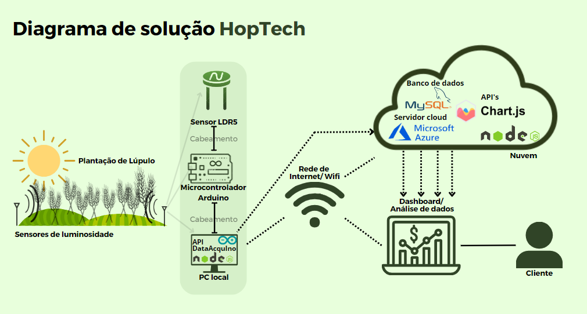
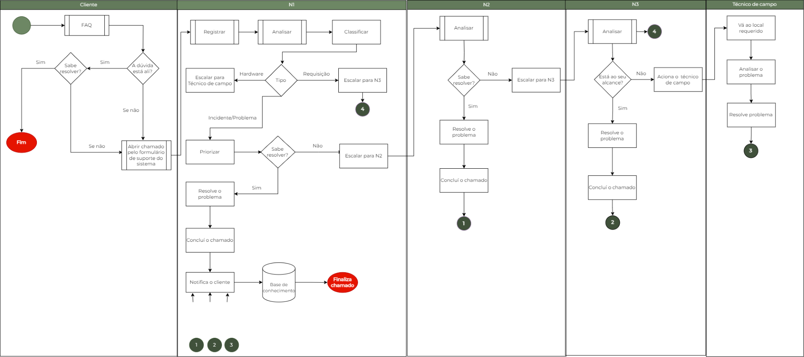
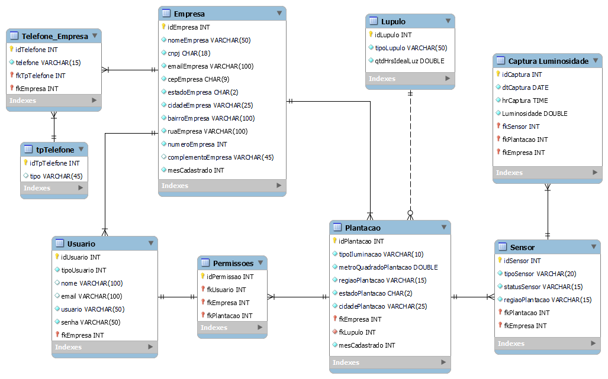

# Conheça a HopTech!

#### O projeto HopTech surgiu com a iniciativa da nossa organização, e é um projeto que tem como principal objetivo desenvolver soluções simples e efetivas para problemas no plantio de lúpulo.
#### Nosso objetivo é auxiliar no controle das plantações por meio de um sistema de monitoramento utilizando sensores e dashboards para coleta e análise de dados.

## Diagrama de soluções
##

 

## 🚀 Ferramentas e Tecnologias Utilizadas

  
  
  
  
  
  
  
  
  

 

## 💻 Desenvolvedores

‣ 👨‍🚀 [Kauanny Tenorio](https://github.com/KakauFelix)
‣ 👨‍🚀 [Nayra Belarmino](https://github.com/nayrabelarmino)
‣ 👨‍🚀 [Lucas Santos](https://github.com/lucasgianine)
‣ 👨‍🚀 [Kaiky Yuji](https://github.com/kaikyuji)
‣ 👨‍🚀 [Vinicius Costa](https://github.com/Vinicius-Costa23)
‣ 👨‍🚀 [Gabriel Namur](https://github.com/gabrielnamur)

## Contexto do Negócio
A produção de lúpulo é um processo fundamental na fabricação da cerveja, sendo o insumo responsável pelo sabor e aroma característicos da bebida. No entanto, a produção de lúpulo enfrenta inúmeros entraves climáticos em ambientes tropicais, sobretudo no Brasil. Dessa forma, depreende-se que o lúpulo requer uma grande quantidade de luz solar (na faixa ideal de dezesseis horas/dia a depender do tipo). Entretanto, observa-se que, no Brasil, o intervalo de emissão solar raramente ultrapassa as doze horas/dia (a depender da região do país, esse intervalo é drasticamente menor).   
Ademais, de forma a contextualizar a celeuma, o cenário hoje posto demonstra o Brasil como o terceiro maior player produtor de cerveja e, em contrapartida, um dos menores produtores de lúpulo (algo em torno de apenas 24 toneladas/ano, de acordo com o Relatório Haas 2020/2021). Assim, conclui-se pela grave dependência do Brasil pelo insumo, o que o leva a importar dos grandes players mundiais a preços onerosos.
  
De acordo com a Associação Brasileira de Produtores de Lúpulo no Brasil (“Aprolúpulo”), a produção de lúpulo nacional está ainda muito aquém da demanda interna baseada em importações. Dessa forma, atualmente, apenas 0.7% da demanda nacional é suprida pela produção interna.
  
Além da questão monetária, existe a preocupação com a qualidade e frescor do insumo, que, por muitas vezes, passa por árduas viagens até o consumidor final, fazendo-o com que perca suas características aromáticas originais, afetando, em parte, o resultado da produção cervejeira. Nesse contexto, surge a necessidade de um controle efetivo de luz para que se possa obter resultados produtivos eficientes.
  
Desse modo, o manejo da iluminação realizado de forma equivocada pode causar um florescimento precoce da planta. Interromper a iluminação precocemente resulta em baixa produtividade em relação ao potencial máximo, e desligar tardiamente resulta em excesso de desenvolvimento das plantas, autossombreamento, excesso de peso sobre a estrutura de sustentação, redução de produtividade e queda da qualidade dos cones (flores).

## Objetivo
O objetivo-alvo do projeto trata-se do desenvolvimento de uma solução em IoT (ou “internet das coisas”) que permita mensurar a luz atual necessária para a produção de lúpulo no campo. A solução deve ser capaz de monitorar a intensidade de exposição à luz, visando à maximização da produção de lúpulo, fornecendo dados para o cliente poder tomar a melhor decisão no manejo de luz, seja esta artificial ou não. 

## Justificativa
A utilização de luz artificial na produção de lúpulo pode trazer inúmeros benefícios de produção (bem como de fomentação e impulsionamento do mercado interno nacional), como a possibilidade de plantio em regiões pouco ideais no quesito de incidência de luz natural, além de reduzir a dependência da produção sazonal.
  
Portanto, a utilização de uma solução em IoT para fornecer dados da luz em tempo real poderá otimizar o processo de produção, reduzir custos e aumentar a eficiência energética da plantação.

## Escopo
A solução em IoT deverá ser composta por sensores de luz Arduino capazes de mensurar os dados de intensidade de luz em tempo real, reproduzidos e armazenados em um sistema de monitoramento via site. Os sensores devem ser capazes de captar a intensidade de luz em tempo real por meio de plugins específicos, bem como o tempo de exposição à luz. O sistema deverá permitir o monitoramento remoto da captação de luz para a produção de lúpulo, possibilitando a tomada de decisões em tempo real.

## Premissas e Restrições
Entre as premissas do projeto estão a disponibilidade de recursos para o desenvolvimento da solução integrando o Arduino com sensores de luminosidade. Partimos igualmente da premissa que o cliente detenha uma plantação de lúpulo em funcionamento e que sua propriedade conte com acesso à internet.
  
Entre as restrições, estão a necessidade de se utilizar o controlador Arduino com sensor de luminosidade. Além da utilização da ferramenta de controle de projeto TRELLO, programação somente em HTML e Javascript e criação de Bando de Dados no SQL Server.

## Fluxograma de Suporte de TI

## Diagrama de Entidade e Relacionamento (DER)

Acesse o <a href="./Site/src/database/">banco de dados</a>.

## Acesse a documentação oficial
<a href="./Document">Documentação</a>